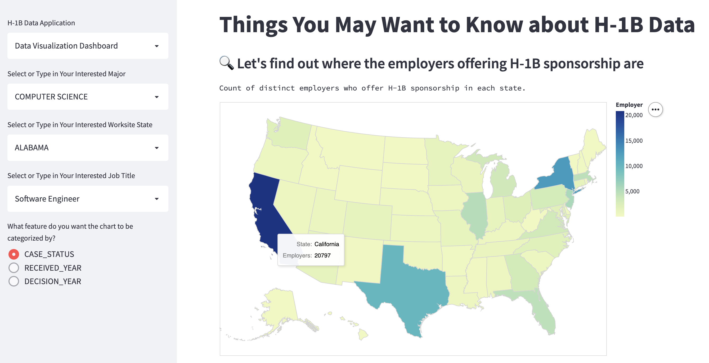

# CMU Interactive Data Science Final Project

* **Title**: H-1B Data Application 
* **Team members**:
  * Erin Lin (lihsinl@andrew.cmu.edu)
  * Kylie Hsieh (hanjuh@andrew.cmu.edu)
* **Online URL**: https://share.streamlit.io/cmu-ids-2022/final-project-ketchup-wants-h1b/main/app.py

## Abstract

The H-1B visa allows employers in the United States to temporarily employ foreign workers in occupations that require the theoretical and practical application of a body of highly specialized knowledge and a bachelor's degree or higher in the specific specialty or its equivalent. We, as international students, will need to obtain an H-1B visa to work in the United States. However, there are only a limited number of visas available each year. Our website aims to provide a one-stop platform for H-1B applicants to understand the visa application status quo of their interested employers.

The website comprises two parts: a data visualization dashboard and a prediction model. The data visualization dashboard allows users to explore the demographics among different employers, job titles, expected wages, and country of citizenship. The prediction model lets users input personal information such as interested employers, job titles, and citizenship to understand the probability of getting approved for their H-1B visa.

## Running Instructions

Check out the Streamlit [getting started](https://docs.streamlit.io/en/stable/getting_started.html) guide and setup your Python environment.

To run the application locally, install the dependencies with pip install `-r requirements.txt` (or another preferred method to install the dependencies listed in requirements.txt). Then run streamlit run `app.py`.

## Paper and Video Demo

The paper can be found [here](https://ieeexplore.ieee.org/document/8933628). The video demo can be accessed [here](https://drive.google.com/file/d/1AWdrKle0DkpRKbu641FDhGY5UvDmiWBQ/view?usp=sharing) (available only to people within Carnegie Mellon University).

## Work distribution

In developing the topic of the project, Erin and Kylie brainstormed ideas together. They spent a couple of hours searching for relevant data sources that are public available, discussing possible visualizations, and collaborating in writing the project proposal.

In the [proposal](Proposal.md), they presented two data sources, including H-1B employers and H-1B applicants data. They also Kylie led the data cleaning and preprocessing, converting the data structure into the feasible format for later visualizations. Erin took parts in literature reivew on the topic of machine learning models for H-1B approvals prediction.

For the final project, Kylie led the development of code for the web application, as well as prediction model design and implementation. Erin led the develoment of the H-1B data visualization dashboard. Both of them fixed small bugs that they saw in the application in a timely manner. 

## Deliverables

### Proposal

- [x] The URL at the top of this readme needs to point to your application online. It should also list the names of the team members.
- [x] A completed [proposal](Proposal.md). Each student should submit the URL that points to this file in their github repo on Canvas.

### Sketches

- [x] Develop sketches/prototype of your project.

### Final deliverables

- [x] All code for the project should be in the repo.
- [x] Update the **Online URL** above to point to your deployed project.
- [ ] A detailed [project report](Report.md).  Each student should submit the URL that points to this file in their github repo on Canvas.
- [x] A 5 minute video demonstration.  Upload the video to this github repo and link to it from your report.
