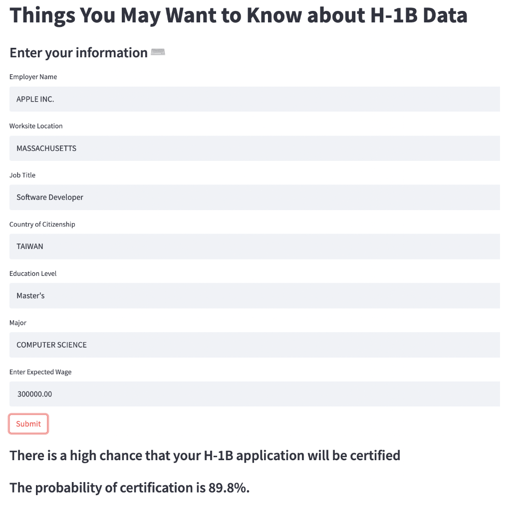

# Final Project Report

**Project URL**: [Click here](https://share.streamlit.io/cmu-ids-2022/final-project-ketchup-wants-h1b/main/app.py)
**Video URL**: [Click here](https://drive.google.com/file/d/1AWdrKle0DkpRKbu641FDhGY5UvDmiWBQ/view?usp=sharing) (available only to people within Carnegie Mellon University)

## Abstract
The H-1B visa allows employers in the United States to temporarily employ foreign workers in occupations that require the theoretical and practical application of a body of highly specialized knowledge and a bachelor's degree or higher in the specific specialty or its equivalent. We, as international students, will need to obtain an H-1B visa to work in the United States. However, there are only a limited number of visas available each year. Our website aims to provide a one-stop platform for H-1B applicants to understand the visa application status quo of their interested employers.

The website comprises two parts: a data visualization dashboard and a prediction model. The data visualization dashboard allows users to explore the demographics among different employers, job titles, expected wages, and country of citizenship. The prediction model lets users input personal information such as interested employers, job titles, and citizenship to understand the probability of getting approved for their H-1B visa.

## Introduction
The H-1B visa allows employers in the United States to temporarily employ foreign workers in occupations that require the theoretical and practical application of a body of highly specialized knowledge and a bachelor's degree or higher in the specific specialty or its equivalent.
We, as international students, will need to obtain an H-1B visa to work in the United States. However, there are only a limited number of visas available each year. It is beneficial for international students to have a one-stop platform to understand the visa application status quo of their interested employers.

The purpose of our project is to provide a one-stop platform for international students to obtain information about H-1B visa sponsors during the process of job searching. Our platform will be composed of two sections:
* Informational visualizations of H-1B visa applications that allow users to query H-1B applications based on job titles, wages, worksite locations, majors
* A machine learning-based model that estimates the probability of visa approval

We are interested in exploring the following questions:
* Is it possible to predict the number of approved visas for each company based on historical data?
* How do different factors, including job titles, wages, and worksite locations, relate to the probability of getting a visa?
* Are we able to predict the probability of H-1B visa approvals based on historical data?

## Related Work
The research paper "Prediction of H1B Visa Using Machine Learning Algorithms" by D. Swain, K. Chakraborty, A. Dombe, A. Ashture, and N. Valakunde estimated the likelihood of visa approval and clustered the data by using random forest, K-Means, and Logistic regression. The features that the paper included in the model are employer names, job title, visa petition year, Standard Occupational Classification code, wage, full-time position, and worksite. We wanted to refine the model by adding more related features such as country of citizenship, education level, and major.

## Methods
### Data Collection and Preprocessing
* H-1B Employer Data

We collected the annual data from 2019 to 2021 and combined three datasets. Based on the intended visualizations, we only kept four columns: `Employer`, `State`, `City`, and `ZIP Code`. In addition, We summed `Initial Approval` and `Continuing Approva`l into `Total Approval`, `Initial Denial` and `Continuing Deinal` into `Total Denial`, to provide the complete data throughout the three years.

* LCA Data (H-1B Applicants Data)

We collected annual LCA data from 2019 to 2021 and combined three datasets into one. To generate exploratory visualizations, we first pre-processed the data by filtering the data by visa type and only keeping H-1B visa applications. Second, we removed the columns that we will not be not using in the prediction model. There are 13 columns in our final dataset (See the below table). Finally, we removed all rows which include missing values (NA) to have the complete data for model training, and it is feasible because there is only a small amount of data that contain NA. Our final data has 123,863 rows.

### Data Visualization Dashboard

### Approval Probability Prediction Model
To build our prediction model, we select the columns that are user-dependent. The columns included `EMPLOYER_NAME`, `WORKSITE_STATE`, `WAGE_OFFER_FROM`, `JOB_TITLE`, `COUNTRY_OF_CITIZENSHIP`, `FOREIGN_WORKER_EDUCATION`, `FOREIGN_WORKER_INFO_MAJOR`. 
After reviewing all the unique values in `EMPLOYER_NAME`, `JOB_TITLE`, `COUNTRY_OF_CITIZENSHIP`, and `FOREIGN_WORKER_INFO_MAJOR`, we found that more than 15000 values in these columns only appeared in the whole dataset less than ten times. Since we will be doing one-hot encoding for these categorical variables, to reduce the computational complexity and time, we decided to filter out those data whose appearances are less than or equal to 10.
In addition, the application dataset is an imbalanced dataset. After removing the low-appearance values, the number of certified data is 55578, while the number of denied data is only 1105. Therefore, we downsampled the certified data to a ratio of 5:1 to the denied data. Next, we used pandas built-in function pd.get_dummies() to apply one-hot encoding to all the categorical variables and then separated our data into training and testing sets with a ratio of 7:3.
We applied a random forest classifier to build our prediction model. Our dependent variable is `CASE_STATUS_Certified`, which encodes certified data as 1 while denied data as 0.

## Results
### Data Visualization Dashboard

### Approval Probability Prediction Model

Below is the user interface of our prediction model. Users can select or type in and search their own information on the right hand side. After entering all the data needed, click submit and the application will calculate the probability of getting approved by the US government. The predicted result will show at the bottom of the window. For example, if the user is a software developer working for Apple in Massachusetts with an expected wage of $300,000 and he is a Taiwan citizen with a master degree of  computer science, there will be approximately 89.8% of possibility that he could be certified for H-1B visa.

Our random forest model yielded an accuracy of 88% on our test set. Below is the classification report generated from Scikit Learn.

## Discussion
According to the result of the paper published in 2018, the accuracy of their random forest regression model is 72%. Our new model has an accuracy of 88%. By adding some new variables, we successfully enhanced our model performance. Our users could be more confident about our application and get useful insight from our application.

## Future Work
So far, we only included data from 2019 to 2021 due to time and computational load constraints. We would like to expand the range of our data to more years. Also, since there are no standard formats for applicants’ majors and job titles, there are many similar values that could possibly be combined together. For example, `software developer`, `software engineer`, `software development engineer` could be possibly categorized in the same job category. Moreover, the level of each job is also recorded in job titles, such as `Software engineer I`, `Software engineer II`, and `Software engineer III`, etc. If we could find out a way to standardize the job title and separate the level of each job, maybe we could gain a more accurate result.
